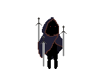
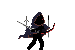
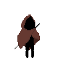

# Music Visualiser Project

Name: Siu Dzoen Lee

Student Number: C19401596

# Description of the assignment

My assignment is a simple game where the player must fight a final boss. This fight is accompanied by a rain effect and alongside it is the addition of three songs that inspired the overall design and direction of the game. Mainly, the song used in the main fight called "Ihojin No Yaiba" which came from a final fight scene in the movie "Sword of The Stranger". There are four game states that occur. First game state is the main menu where the game starts, the second state is when the fight starts, the third state is the victory state and finally the fourth state is the death state.

## Music used in assignment

Main Menu and Battle Theme - "Ihojin No Yaiba" from the movie "Sword of The Stranger"

Victory Theme - "Fires of War" from the game "Middle-earth: Shadow of War"

Death Theme - "Farewell Life" by Nights Amore and Arn Anderson

# Instructions - How to play

### Menu controls: 
Press 0 to skip main menu, death menu and victory menu

### In game controls:
Press 'a' to move left and Press 'd' to move right

Press 'spacebar' to jump

Press or Hold 'j' to attack

# How it works
To load the game, press 'f5' when lauching it from Visual Studio Code. The game will launch and the main menu will fade onto the screen. During this fading in sequence, player is able to skip it by pressing '0'. After this stage, the in game fight will begin and the player and enemy health bar will fade onto the screen. There are two outcomes to this fight, if the player dies. The game will change its state to a death state and the player will be met with a death menu, player is then prompted to press '0' to continue. if the player beats the final boss, the game state will change to a victory state and a victory menu will be presented, player is then prompted to press '0' like the previous state in order to continue.

# What I am most proud of in the assignment

My proudest achievement in this assignment is the implementation of animating the sprites and the actual design and drawing of the sprites as show below:

### Image of Sprites





### Player animation code

```java
public void animator(PImage[] a){
    PImage[] anim = a;
    if(delay == 0){
        frame = (frame + 1) % anim.length;
    }
    delay = (delay + 1) % 3;
    game.image(anim[frame], x, y, pWidth, pHeight);
}
```

# OOP Music Visuals Assignment Youtube Video

[](https://www.youtube.com/watch?v=LAeVNd2o4XA)